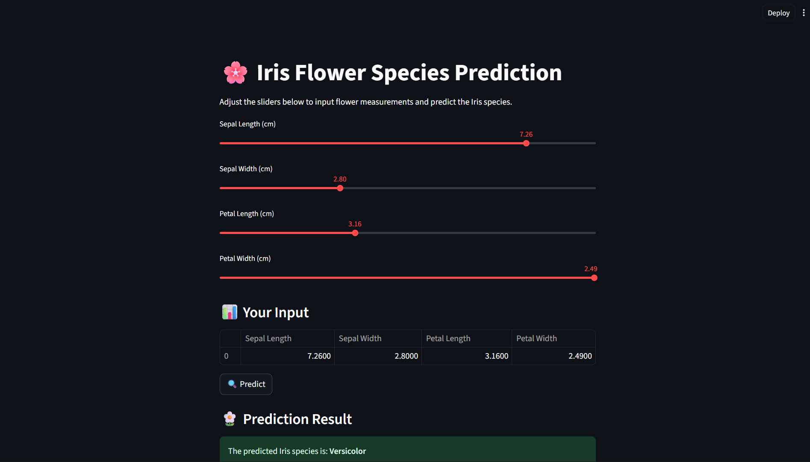

# 🌸 Iris Flower Species Prediction App

A simple **Machine Learning + Streamlit** web application that predicts the species of an Iris flower based on its measurements (Sepal Length, Sepal Width, Petal Length, Petal Width).  

This project uses a **Logistic Regression** model trained on the classic **Iris dataset** and deployed with Streamlit for interactive predictions.

---

## ⚡ Features
- Input flower measurements using sliders  
- Predict Iris species: **Setosa**, **Versicolor**, or **Virginica**  
- Shows probability confidence for each class  
- Displays flower images for the predicted species  
- Interactive web app built with **Streamlit**  

---

## 🧠 Algorithm Used
- **Logistic Regression** (from `scikit-learn`)  
  - A supervised learning classification algorithm  
  - Maps flower measurements to one of three species  
  - Provides probability scores for each class  

---

## 📂 Project Structure

---

## ⚙️ Installation

### 1. Clone the repository
```bash
git clone https://github.com/your-username/iris-prediction-app.git
cd iris-prediction-app
python -m venv venv
venv\Scripts\activate   # On Windows
source venv/bin/activate   # On Mac/Linux
pip install -r requirements.txt
streamlit run app.py


---

